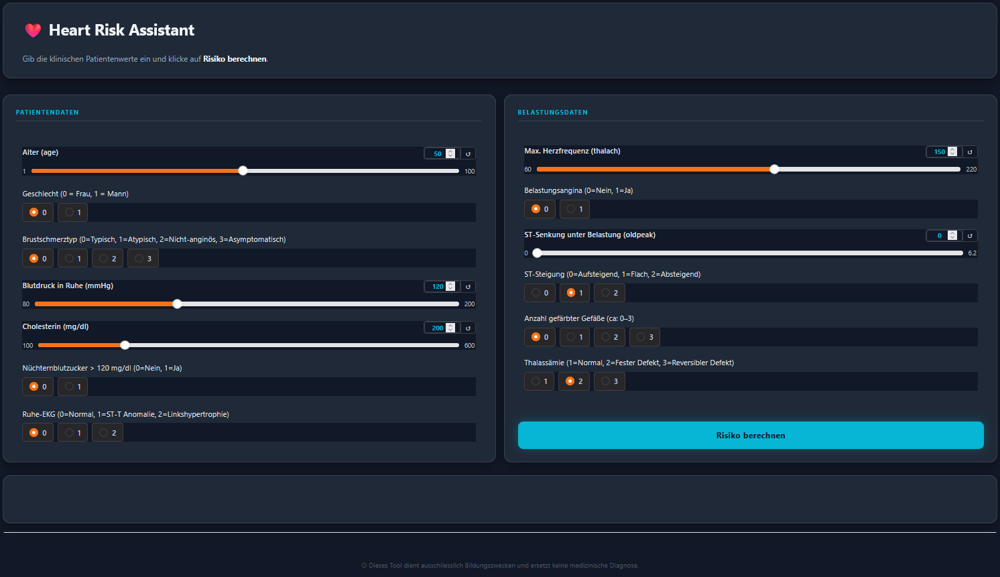
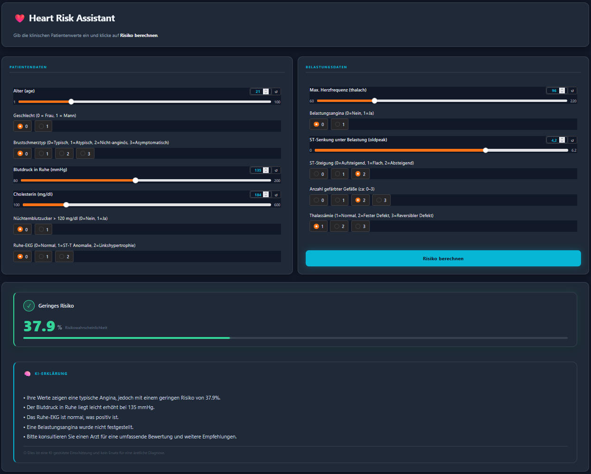
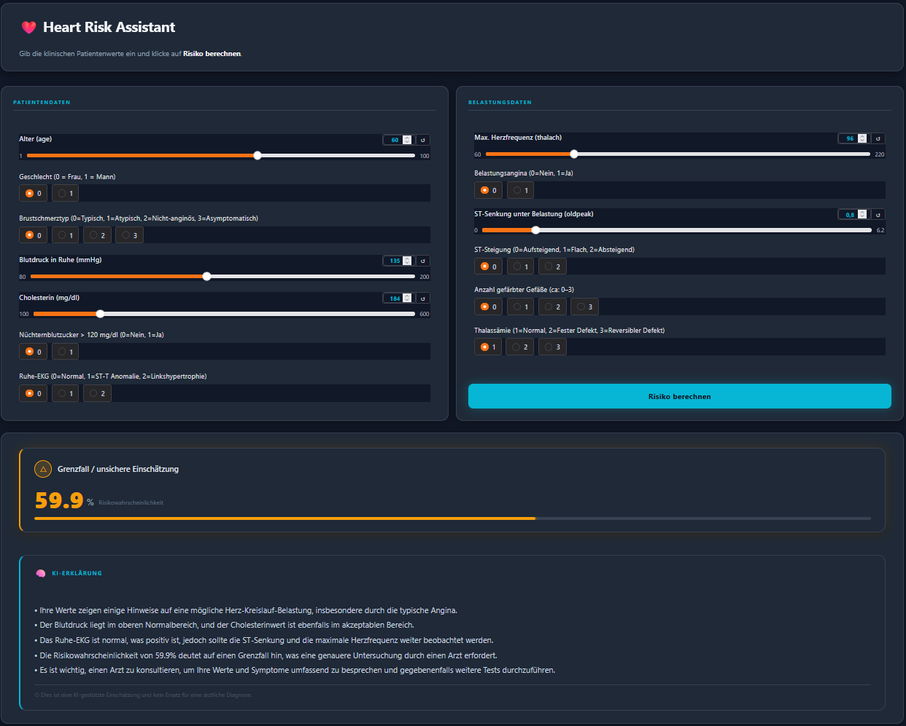
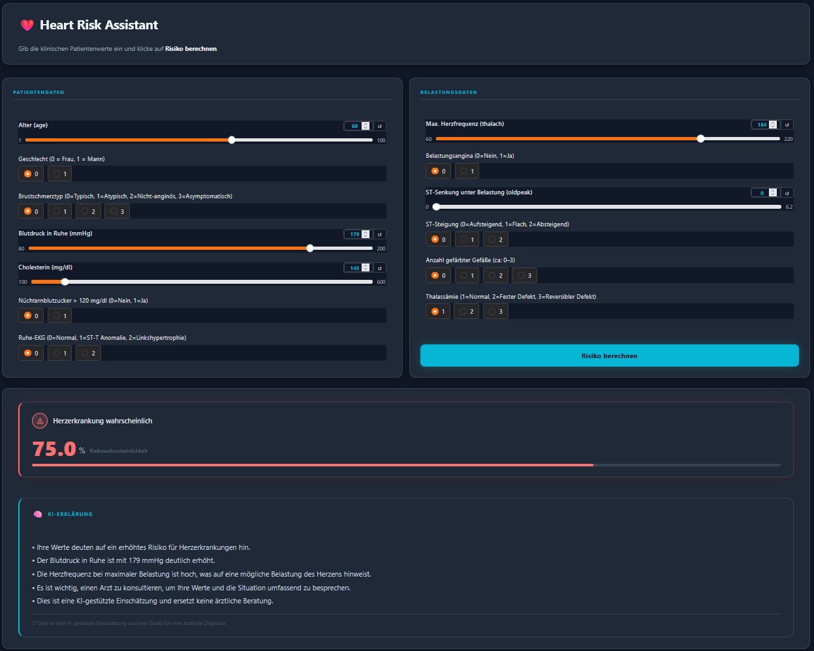

# AI Applications Project Documentation

## Project Metadata

- Project title: Heart Risk Assistant
- Student: Suad Sopa
- GitHub repository URL: https://github.com/sopasua1/health-risk-assistant
- Deployment URL: https://huggingface.co/spaces/Sopasua1/health-risk-assistant
- Submission date: 07.06.2026

### Mandatory Setup Checks

- [x] At least 2 blocks selected
- [x] Multiple and different data sources used
- [x] Deployment URL provided
- [x] Required GitHub users added to repository (`jasminh`, `bkuehnis`)

## Selected AI Blocks

- [x] ML Numeric Data
- [x] NLP
- [ ] Computer Vision

Primary blocks used for core solution:

- Primary block 1: ML Numeric Data
- Primary block 2: NLP

---

## 1. Project Foundation (Short)

### 1.1 Problem Definition

- **Problem statement:** Cardiovascular diseases are among the leading causes of death worldwide. Early risk assessment based on clinical parameters can support medical professionals in identifying high-risk patients.
- **Goal:** Develop a clinical decision support tool that predicts heart disease risk from patient data and provides an AI-generated explanation of the result in German.
- **Success criteria:** The application correctly classifies patients into risk categories (low / borderline / high) and generates meaningful NLP explanations that support medical professionals in interpreting results.

### 1.2 Integration Logic

- **How the selected blocks interact:** The ML block processes structured patient data and outputs a risk probability. This probability, together with all input values, is passed to the NLP block (GPT-4o-mini) which generates a human-readable explanation.
- **Data and output flow between blocks:**
  1. User inputs 13 clinical parameters (age, sex, chest pain type, blood pressure, cholesterol, etc.)
  2. ML model (Random Forest) predicts heart disease risk probability
  3. Risk probability + all input values → GPT-4o-mini prompt
  4. GPT generates a 3–5 bullet point explanation in German
  5. Both outputs (risk panel + NLP explanation) are displayed in the Gradio interface

---

## 2. Block Documentation

### 2A. ML Numeric Data

#### 2A.1 Data Source(s)

| Entry | Source name or link | Type | Size | Role in this block |
| --- | --- | --- | --- | --- |
| 1 | [Heart Disease Dataset (Kaggle)](https://www.kaggle.com/datasets/johnsmith88/heart-disease-dataset) | Structured CSV | 1025 rows, 14 columns | Training and evaluation of classification models |

#### 2A.2 Preprocessing and Features

- **Cleaning steps:** Dataset had no missing values (all 1025 entries non-null across all 14 columns). No imputation required.
- **Preprocessing steps:** Features normalized using StandardScaler for Logistic Regression. Target variable: `target` (0 = no heart disease, 1 = heart disease).
- **Feature engineering and selection:** All 13 clinical features used as input: age, sex, cp (chest pain type), trestbps (resting blood pressure), chol (cholesterol), fbs (fasting blood sugar), restecg (resting ECG), thalach (max heart rate), exang (exercise-induced angina), oldpeak (ST depression), slope (ST segment slope), ca (number of major vessels), thal (thalassemia type).

See *Data Preprocessing* in [`notebooks/eda_and_training.ipynb`](https://github.com/sopasua1/health-risk-assistant/blob/main/notebooks/eda_and_training.ipynb)

#### 2A.3 Model Selection

- **Models tested:** Logistic Regression, Random Forest Classifier
- **Why these models were chosen:** Logistic Regression as a simple, interpretable baseline. Random Forest for its higher performance on tabular data and robustness to outliers.

#### 2A.4 Model Comparison and Iterations

| Iteration | Objective | Key changes | Models used | Main metric | Change vs previous |
| --- | --- | --- | --- | --- | --- |
| 1 | Baseline | Default parameters | Logistic Regression | Accuracy: 80.98% | — |
| 2 | Improve accuracy | Default RF parameters | Random Forest | Accuracy: 100% (overfitting) | +19% |
| 3 | Fix overfitting | max_depth=3, n_estimators=50, min_samples_leaf=10 | Random Forest | Accuracy: 92.68% | Realistic results |

See *Model Comparison* in [`notebooks/eda_and_training.ipynb`](https://github.com/sopasua1/health-risk-assistant/blob/main/notebooks/eda_and_training.ipynb)

#### 2A.5 Evaluation and Error Analysis

- **Metrics used:** Accuracy, Precision, Recall, F1-Score
- **Final results:**
  - Logistic Regression: Accuracy 80.98%, Precision 76.19%, Recall 91.43%, F1 83.12%
  - Random Forest (tuned): Accuracy 92.68%, Precision 89.47%, Recall 97.14%, F1 93.15%
- **Error patterns and likely causes:** Initial Random Forest overfitted (100% accuracy) due to unlimited tree depth. Fixed by limiting max_depth=3 and min_samples_leaf=10. Class distribution was balanced (499 vs 526), so no class imbalance issue.

#### 2A.6 Integration with Other Block(s)

- **Inputs received from other block(s):** None (ML block receives raw user inputs)
- **Outputs provided to other block(s):** Risk probability (`heart_risk_probability`) and all 13 input values are passed to the NLP block for explanation generation.

See predict() in [`app.py`, lines 175-230](https://github.com/sopasua1/health-risk-assistant/blob/main/app.py#L175-L230)

---

### 2B. NLP

#### 2B.1 Data Source(s)

| Entry | Source name or link | Type | Size | Role in this block |
| --- | --- | --- | --- | --- |
| 1 | User input (13 clinical parameters) | Structured input | Per request | Input for prompt construction |
| 2 | OpenAI GPT-4o-mini API | LLM | — | Generates natural language explanation |

#### 2B.2 Preprocessing and Prompt Design

- **Text preprocessing:** No classical text preprocessing. Input values are formatted into a structured German prompt.
- **Prompt design:** The prompt includes all 13 patient values, the risk probability, and the risk category. GPT is instructed to respond in 3–5 bullet points in German, without giving a medical diagnosis, and always recommending consultation with a doctor.

Example prompt structure:
```
Du bist ein medizinischer KI-Assistent. Analysiere folgende Patientendaten...
Risikowahrscheinlichkeit: 75.3% (Herzerkrankung wahrscheinlich)
Patientendaten: Alter: 50, Geschlecht: männlich, ...
Antworte mit 3-5 Stichpunkten auf Deutsch. Keine Diagnose. Empfehle immer einen Arzt.
```

See generate_explanation() in [`app.py`, lines 152-172](https://github.com/sopasua1/health-risk-assistant/blob/main/app.py#L152-L172)

#### 2B.3 Approach Selection

- **Approach used:** Prompt engineering with GPT-4o-mini (OpenAI API)
- **Alternatives considered:** Classical NLP (sentiment analysis, keyword extraction) — rejected as insufficient for medical explanation generation. Transformer-based local models — rejected due to complexity and resource constraints.

#### 2B.4 Comparison and Iterations

| Iteration | Objective | Key changes | Model or prompt setup | Main metric or qualitative check | Change vs previous |
| --- | --- | --- | --- | --- | --- |
| 1 | Basic explanation | Simple prompt, free text | GPT-4o-mini | Output too long, unstructured | — |
| 2 | Structured output | Added bullet point format instruction | GPT-4o-mini | 3–5 bullet points, concise | More readable |
| 3 | Medical safety | Added "no diagnosis" + "consult doctor" constraint | GPT-4o-mini | Safe, professional output | Legally safer |

#### 2B.5 Evaluation and Error Analysis

- **Evaluation strategy:** Qualitative evaluation — multiple test cases with different risk levels checked for relevance, accuracy, and safety.
- **Results:** GPT correctly references the most relevant risk factors (e.g., high chest pain type, low max heart rate) and always includes a disclaimer.
- **Error patterns and likely causes:** Occasionally GPT mentions values that are within normal range as "noteworthy" — this is a known limitation of prompt-based LLMs without grounding.

#### 2B.6 Integration with Other Block(s)

- **Inputs received from other block(s):** Risk probability and risk category from ML block + all 13 raw patient input values
- **Outputs provided to other block(s):** HTML-formatted explanation displayed below the ML risk panel in the Gradio interface

---

## 3. Deployment

- **Deployment URL:** https://huggingface.co/spaces/Sopasua1/health-risk-assistant
- **Main user flow:**
  1. Medical professional enters 13 clinical patient values
  2. Clicks "Risiko berechnen"
  3. Risk panel shows probability (0–100%) with color coding (green/orange/red)
  4. GPT-4o-mini generates a German explanation in bullet points
  5. Disclaimer reminds user this is AI-assisted, not a medical diagnosis
- **Screenshots:**

**App Overview – Eingabemaske mit Patientendaten und Belastungsdaten:**


**Niedriges Risiko – Risikowahrscheinlichkeit unter 40% mit grünem Panel:**


**Grenzfall – Risikowahrscheinlichkeit zwischen 40-60% mit orangem Panel:**


**Hohes Risiko – Risikowahrscheinlichkeit über 60% mit rotem Panel und NLP-Erklärung:**


---

## 4. Execution Instructions

- **Environment setup:**
```bash
cd heart-risk-app
python -m venv .venv
.venv\Scripts\activate  # Windows
pip install -r requirements.txt
```

- **Data setup:** Place `heart.xls` in `data/` folder. Already included in repository.

- **Training command:**
```bash
# Open and run all cells in:
notebooks/eda_and_training.ipynb
# This trains both models and saves best_model.pkl to models/
```

- **Inference/run command:**
```bash
python app.py
# App runs at http://127.0.0.1:7860
```

- **Reproducibility notes:**
  - Python 3.11+
  - All dependencies in `requirements.txt`
  - OpenAI API key required — create `.env` file with `OPENAI_API_KEY=your-key`
  - Random seed: `random_state=42` used in all models

---

## 5. Optional Bonus Evidence

- [ ] Third selected block implemented with strong quality
- [ ] More than two data sources used with clear added value
- [ ] A core section is done exceptionally well
- [x] Extended evaluation
- [x] Ethics, bias, or fairness analysis
- [ ] Creative or exceptional use case

**Evidence for selected bonus items:**

**Extended evaluation:** Two models trained and compared (Logistic Regression vs Random Forest). Overfitting detected and corrected through hyperparameter tuning (max_depth, min_samples_leaf). Multiple metrics reported (Accuracy, Precision, Recall, F1).

**Ethics and limitations:** The Heart Risk Assistant is designed exclusively for use by medical professionals (physicians, clinical staff) as a decision support tool — not for self-diagnosis by patients. All required input values (cholesterol, ECG results, thalassemia type, etc.) are clinical measurements only available through medical examinations. The tool always displays a disclaimer that results are AI-assisted and do not replace a medical diagnosis. The model's risk probability reflects the confidence of the ensemble of decision trees, not a direct medical probability. Users are always advised to consult a physician for further evaluation.
